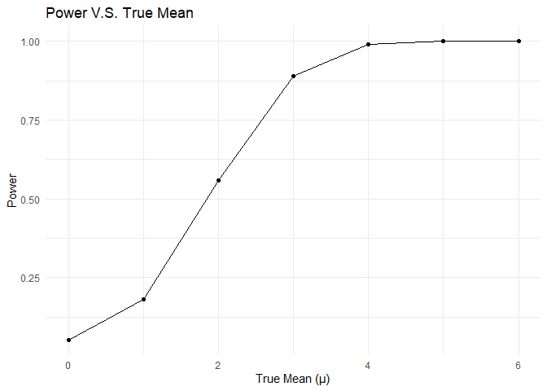

p8105_hw5_lz3014
================
2024-11-15

``` r
library(tidyverse)
library(broom)
library(purrr)

set.seed(1115)
```

# Problem 1

### 1. Write a function to simulate and check birthdays

``` r
birthd_sim <- function(n){
  bdays = sample(1:365, n, replace = TRUE)
  duplicate = (length(unique(bdays)) < n)
  
  return(duplicate)
}
```

### 2. Run this function 10000 times for each group size between 2 and 50

``` r
dup_bd_prob <- expand_grid(
  n = 2:50,
  iter = 1:10000
) |>
  mutate(dup = map_lgl(n, birthd_sim)) |>
  group_by(n) |>
  summarize(dup_prob = mean(dup))

head(dup_bd_prob, 10)
```

    ## # A tibble: 10 × 2
    ##        n dup_prob
    ##    <int>    <dbl>
    ##  1     2   0.0017
    ##  2     3   0.0088
    ##  3     4   0.015 
    ##  4     5   0.0237
    ##  5     6   0.0367
    ##  6     7   0.0544
    ##  7     8   0.0752
    ##  8     9   0.0986
    ##  9    10   0.117 
    ## 10    11   0.137

### 3. Plot: Probability of Shared Birthday

``` r
dup_bd_prob |>
  ggplot(aes(x = n, y = dup_prob)) +
  geom_line() +
  labs(
    title = "Probability of Shared Birthday",
    x = "Group Size",
    y = "Probability of Shared Birthday"
  )
```

<!-- -->

**Comments:**  
- The curve indicates a rapid increase in the probability of shared
birthdays as the group size grows, and then reach near 100% when n is
around 40.

# Problem 2

### 1. $\mu$ = 0

``` r
mu_0 <- tibble(
  iter = 1:5000,
  data = map(iter, \(i) rnorm(n = 30, mean = 0, sd = 5))
) |>
  mutate(
    t_test = map(data, \(x) t.test(x, mu = 0, conf.level = 0.95)),
    t_result = map(t_test, broom::tidy)) |>
  unnest(t_result) |>
  select(iter, data, mu_estimate = estimate, p_value = p.value)

head(mu_0, 10)
```

    ## # A tibble: 10 × 4
    ##     iter data       mu_estimate p_value
    ##    <int> <list>           <dbl>   <dbl>
    ##  1     1 <dbl [30]>      0.0899  0.934 
    ##  2     2 <dbl [30]>      0.202   0.843 
    ##  3     3 <dbl [30]>      1.55    0.0889
    ##  4     4 <dbl [30]>      0.0111  0.986 
    ##  5     5 <dbl [30]>     -0.0320  0.972 
    ##  6     6 <dbl [30]>     -0.478   0.558 
    ##  7     7 <dbl [30]>      0.524   0.497 
    ##  8     8 <dbl [30]>     -0.501   0.631 
    ##  9     9 <dbl [30]>     -0.543   0.543 
    ## 10    10 <dbl [30]>      0.542   0.597

Write it into a function and repeat the above for μ={1,2,3,4,5,6}

``` r
t_test_func <- function(mu, sample_size = 30, sigma = 5, alpha = 0.05){
  tibble(
  iter = 1:5000,
  data = map(iter, \(i) rnorm(n = sample_size, mean = mu, sd = sigma))
) |>
  mutate(
    t_test = map(data, \(x) t.test(x, mu = 0, conf.level = (1 - alpha))),
    t_result = map(t_test, broom::tidy)) |>
  unnest(t_result) |>
  select(iter, data, mu_estimate = estimate, p_value = p.value)
}
```

``` r
sim_6_mu <- map_df(0:6, \(mu) t_test_func(mu) 
                      |> mutate(mu_true = mu)) |>
  select(-iter)

head(sim_6_mu, 10)
```

    ## # A tibble: 10 × 4
    ##    data       mu_estimate p_value mu_true
    ##    <list>           <dbl>   <dbl>   <int>
    ##  1 <dbl [30]>       0.423   0.653       0
    ##  2 <dbl [30]>      -1.48    0.132       0
    ##  3 <dbl [30]>       0.886   0.236       0
    ##  4 <dbl [30]>       0.273   0.795       0
    ##  5 <dbl [30]>      -0.428   0.589       0
    ##  6 <dbl [30]>       0.464   0.590       0
    ##  7 <dbl [30]>      -0.695   0.448       0
    ##  8 <dbl [30]>      -0.375   0.682       0
    ##  9 <dbl [30]>      -0.794   0.307       0
    ## 10 <dbl [30]>      -0.207   0.841       0

### 2. Plot: Power V.S. True Mean

``` r
sim_6_mu_power <- sim_6_mu |>
  group_by(mu_true) |>
  summarize(
    reject_count = sum(p_value < 0.05),
    total_count = n(),
    power = reject_count / total_count
  )
```

``` r
sim_6_mu_power |>
  ggplot(aes(x = mu_true, y = power)) +
  geom_line() +
  geom_point() +
  labs(
    title = "Power V.S. True Mean",
    x = "True Mean (μ)",
    y = "Power"
  ) +
  theme_minimal()
```

<!-- -->

**Association between effect size and power**  
- As the true mean (effect size) increases, the power of the test also
increases because it’s easier to notice the difference when the true
mean is higher.

### 3. `Plot1: Average Estimate of $\mu$ V.S. True Mean` and `Plot2: Average Estimate of $\mu$ for Rejected Nulls`

Plot1:

``` r
avg_mu_estimate <- sim_6_mu |>
  group_by(mu_true) |>
  summarize(mean_mu_estimate = mean(mu_estimate))
```

``` r
avg_mu_estimate |>
  ggplot(aes(x = mu_true, y = mean_mu_estimate)) +
  geom_line() +
  geom_point() +
  labs(
    title = "Average Estimate of μ V.S. True Mean",
    x = "True Mean (μ)",
    y = "Average Estimate (μ_hat)"
  ) +
  theme_minimal()
```

<!-- -->

Plot2:

``` r
avg_mu_estimate_rejected <- sim_6_mu |>
  filter(p_value < 0.05) |>
  group_by(mu_true) |>
  summarize(mean_mu_estimate_rejected = mean(mu_estimate))
```

``` r
avg_mu_estimate_rejected |>
  ggplot(aes(x = mu_true, y = mean_mu_estimate_rejected)) +
  geom_line() +
  geom_point() +
  labs(
    title = "Average Estimate of μ for Rejected Nulls",
    x = "True Mean (μ)",
    y = "Average Estimate (μ_hat) for Rejected Nulls"
  ) +
  theme_minimal()
```

<!-- -->

Is the sample average of $\hat{\mu}$ across tests for which the null is
rejected approximately equal to the true value of $\mu$ ? Why or why
not? - No. Because the tests for which the null is rejected are biased
towards samples with extreme values, which tend to have larger
estimation compared to the true mean.
